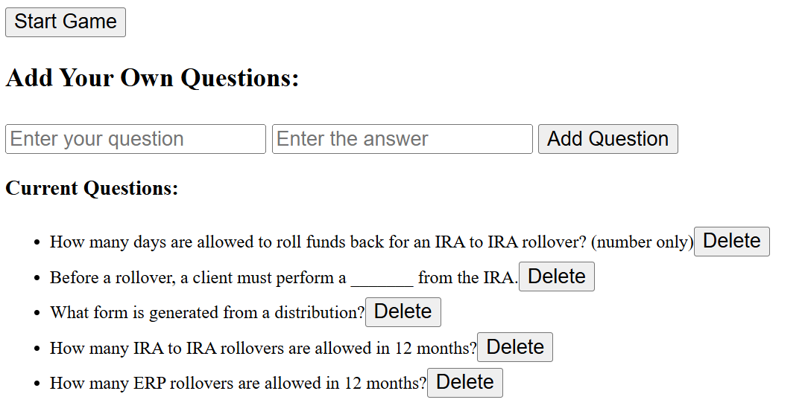
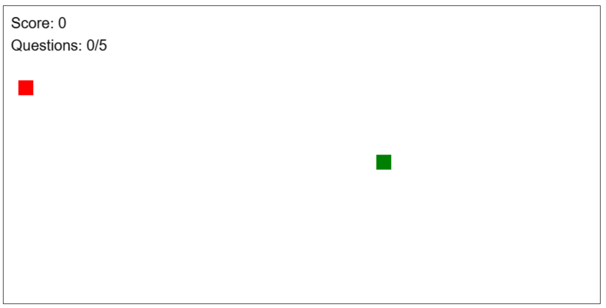

<!-- Improved compatibility of back to top link: See: https://github.com/othneildrew/Best-README-Template/pull/73 -->

<h3 align="center">Snake Quiz Game</h3>

  

    A simple snake game used for reviewing various topics in retirement.
     
    ·
    <a href="https://github.com/github_username/repo_name/issues/new?labels=bug&template=bug-report---.md">Report Bug</a>
    ·
    <a href="https://github.com/github_username/repo_name/issues/new?labels=enhancement&template=feature-request---.md">Request Feature</a>
  

### Built With

- HTML
- Javascript
- CSS

(<a href="#readme-top">back to top</a>)

<!-- GETTING STARTED -->

## Getting Started

Run the "snakequiz.html" file to start.

### Prerequisites

Simple html file. No prerequistites should be needed. Runs in Edge and Chrome.

### Installation

1. No installation needed. Run the "snakequiz.html" file to start.

(<a href="#readme-top">back to top</a>)

<!-- USAGE EXAMPLES -->

## Usage

A simple snake game used for review of simple short answer concepts. Questions are randomized and displayed
each time the snake hits a red square. If the question is answered correctly, an extra point is added
to the point given for the collision with the red square.

(<a href="#readme-top">back to top</a>)

<!-- ROADMAP -->

## Roadmap

- [Simple Snake Game] 5 question scored with simple square snake
- [Better CSS] Update visual layout
- [JSON file] Update to include a separate usable JSON file

(<a href="#readme-top">back to top</a>)

<!-- CONTRIBUTING -->

## Contributing

If you have a suggestion that would make this better, please fork the repo and create a pull request. You can also simply open an issue with the tag "enhancement".
Don't forget to give the project a star! Thanks again!

1. Fork the Project
2. Create your Feature Branch (`git checkout -b feature/AmazingFeature`)
3. Commit your Changes (`git commit -m 'Add some AmazingFeature'`)
4. Push to the Branch (`git push origin feature/AmazingFeature`)
5. Open a Pull Request

(<a href="#readme-top">back to top</a>)

<!-- LICENSE -->

## License

Distributed under the MIT License. See `LICENSE.txt` for more information.

(<a href="#readme-top">back to top</a>)

<!-- CONTACT -->

## Contact

Your Name - doughott@gmail.com

Project Link: [https://github.com/djhott/SnakeQuiz1.0](https://github.com/djhott/SnakeQuiz1.0)

(<a href="#readme-top">back to top</a>)

<!-- ACKNOWLEDGMENTS -->

## Acknowledgments

- [Claude AI Assistant](https://claude.ai)

(<a href="#readme-top">back to top</a>)

